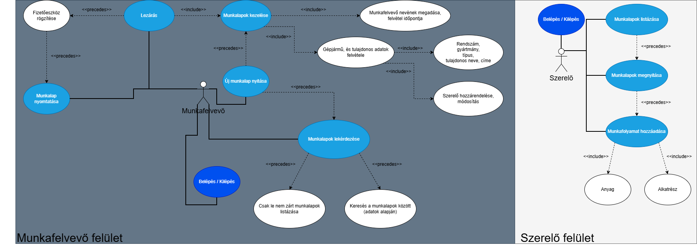
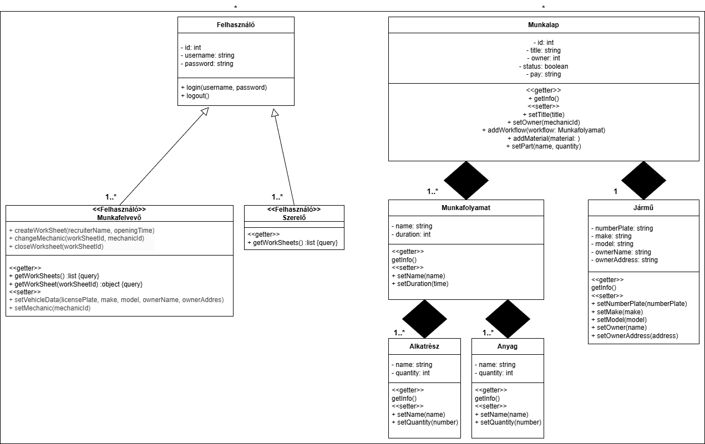
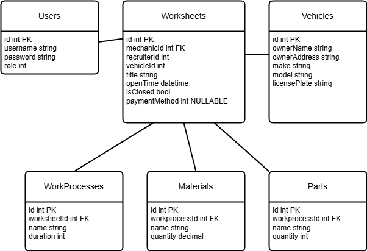

# Szerelőműhely dokumentáló web alkalmazás c#
## Munkafelvevő 
- Belépés (azonosítóval) / Kilépés
- Új munkalap nyitása
   - Munkafelvevő neve, felvétel időpontja
   - Gépjármű és a tulajdonos adatainak felvétele
        - Rendszám, gyártmány, típus, tulajdonos neve, címe
        - Szerelő hozzárendelése, módosítása, lezárás
        - Lezárt munkalap utólag nem módosítható
- Korábbi munkalapok listázása (dátum szerint)
- Keresés a munkalapok között (adatok alapján)
- Csak a le nem zárt munkalapok listázása
- Listázáskor látja az:
    - összesített árat
    - lezáráskor rögzítheti, hogy a vevő készpénzzel, vagy bankkártyával fizetett (utólag látható a munkalapon)
    - lezárt munkalapot ki is nyomtathatja

## Szerelő
- Belépés (azonosítóval) / Kilépés
- Listázhatja a hozzá rendelt nem lezárt munkalapokat, és megnyithatja bármelyiket
- A munkalapokra tetszőleges számú munkafolyamatot adhat hozzá
    > Munkafolyamat (név, időtartam)
    - anyag (név, mennyiség)
    - alkatrész (név, mennyiség)
    - Az elemek kiválaszthatóak, csak az időtartamot, illetve a mennyiséget kell megadni

## Use-case diagram

## Class-diagram

## Database schema

## Figma prototípus link
https://www.figma.com/proto/NkwekLluFjyfWneQjvs5Nw/Service?node-id=0-1&t=Jao9V7XTpQHqPBwX-1